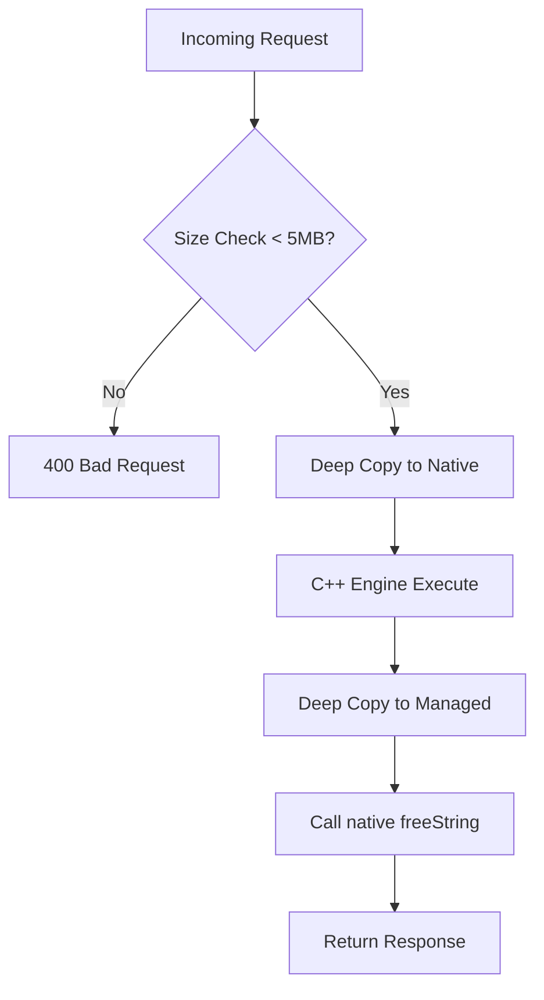

# .NET 8 API Gateway: Native Interop Service

This module serves as the managed gateway for the Case Conversion ecosystem. It provides a robust, thread-safe ASP.NET Core REST API that orchestrates communication with the high-performance C++ native engine via Dynamic P/Invoke.

## Table of Contents

* [Architectural Overview](#architectural-overview)
* [Key Design Patterns](#key-design-patterns)
* [Getting Started](#getting-started)
  * [Prerequisites](#prerequisites)
* [Testing Infrastructure](#testing-infrastructure)
  * [Test Categories](#test-categories)
* [API Contract](#api-contract)
* [Security & Memory Governance](#security--memory-governance)
* [Native Interop Architectural Principles](#native-interop-architectural-principles)
  * [1. The "Callee-Allocates, Caller-Frees" Pattern](#1-the-callee-allocates-caller-frees-pattern)
  * [2. Dynamic Library Loading](#2-dynamic-library-loading)
  * [3. Thread Safety & Lifecycle Management](#3-thread-safety--lifecycle-management)
* [Telemetry & Observability](#telemetry--observability)
  * [Setup Instructions](#setup-instructions)
  * [Analyzing the Waterfall](#analyzing-the-waterfall)
* [Request Lifecycle Flow](#request-lifecycle-flow)

## Architectural Overview

The .NET layer is designed as a stateless "Thin Wrapper" around the native binary. It handles the critical bridge between Managed (System.String) and Unmanaged (char*) memory.

## Key Design Patterns

* Callee-Allocates / Caller-Frees: Implements an explicit memory ownership contract. The .NET layer invokes the native freeString export immediately after string marshalling to ensure a Zero-Leak heap profile.

* Dynamic DLL Loading: Uses System.Runtime.InteropServices.NativeLibrary for platform-agnostic symbol resolution (Windows .dll, Linux .so, macOS .dylib).

* Dependency Injection (DI): Registered as a Scoped or Singleton service to manage the lifecycle of the native library handle.

* Hardened Guardrails: Integrates with the native engine's 2MB buffer limit to prevent Heap Exhaustion or DoS attacks.

## Getting Started

### Prerequisites

* .NET 8.0 SDK

* Compiled C++ Shared Library (libProcessStringDLL) present in the project root or build output.

1. Automated Execution

Use the provided shell script to handle the entire lifecycle (Restore → Build → Publish → Run).

```Bash
chmod +x run-dotnet.sh
./run-dotnet.sh
```

2.Manual Development Workflow

```Bash
# Navigate to project
cd CaseConversionAPI/DotNetAPI

# Restore and Build
dotnet restore
dotnet build -c Release

# Execute
dotnet run --project DotNetAPI.csproj
```

## Testing Infrastructure

The project includes an extensive Integration Test Suite using Microsoft.AspNetCore.Mvc.Testing. This validates the full request-to-native-execution pipeline.

### Test Categories

* Basic: Core case transformations (Upper, Lower, Reverse).

* Advanced: Complex logic (SnakeCase, LeetSpeak, InvertWords).

* Edge Cases: Boundary validation for empty strings and whitespace.

* Contractual Safety: Validation of out-of-range choices and large input handling.

```Bash
# Run the xUnit suite
dotnet test
```

## API Contract

POST /api/WordCase/convert

Request Body:

```Bash
{
  "text": "The quick brown fox",
  "choice": 11
}
```

Successful Response (200 OK):

```Bash
{
  "output": "the_quick_brown_fox",
  "processedAt": "2026-04-14T20:45:00Z"
}
```

## Security & Memory Governance

| Feature              | Implementation                    | Architectural Justification                                                                                                                                        |
|--------------------- |---------------------------------- |-----------------------------                                                                                                                                       |
| Memory Cleanup       | `IDisposable` & `freeString`      | Implements the "Callee-Allocates, Caller-Frees" contract. Ensures unmanaged heap memory is reclaimed immediately after marshalling, achieving a zero-leak profile. |
| ABI Safety           | `Marshal.PtrToStringAnsi`         | Performs a deep-copy of native memory into the managed garbage-collected (GC) heap. This decouples the .NET string lifecycle from the native buffer.               |
| Boundary Protection  | Strict O(n) Length Checks         | Enforces a 2MB security gate at the native entry point. Prevents heap exhaustion and buffer overflow attacks before memory is allocated for strategies.            |
| Thread Safety        | Stateless Reentrancy              | The native engine is entirely stateless and stack-allocated, allowing the .NET ThreadPool to execute concurrent P/Invoke calls without mutex contention.           |

## Native Interop Architectural Principles

### 1. The "Callee-Allocates, Caller-Frees" Pattern

This is a critical memory management strategy for interop. By exporting a `freeString` function from the C++ library and invoking it via a delegate within a .NET `finally` block, the system eliminates the primary cause of memory leaks.

This ensures that unmanaged memory is explicitly released, as the .NET Garbage Collector cannot track or free memory allocated by the native engine.

### 2. Dynamic Library Loading

The service utilizes the `NativeLibrary.Load` API combined with runtime OS detection instead of static `[DllImport]` attributes.

This architectural choice ensures the API is truly cross-platform, allowing it to resolve and load the correct shared library format (`.dll`, `.so`, or `.dylib`) based on the deployment environment.

### 3. Thread Safety & Lifecycle Management

By implementing the full `IDisposable` pattern (including the `Dispose(bool disposing)` method and a finalizer), the service guarantees native resource cleanup.

This fail-safe mechanism ensures that even if a consumer fails to explicitly dispose of the service, the native library handle is released to the Operating System, preventing handle leaks.

---

## Telemetry & Observability

This project implements **Distributed Tracing** to monitor the lifecycle of a request as it transitions from the Managed .NET layer into the Native C++ engine.

### Prerequisites docker

* Docker Desktop (for Jaeger backend)
* .NET 8.0 SDK

### Setup Instructions

#### 1. Install Dependencies

Navigate to the API project folder and install the OTEL packages:

```bash
  cd CaseConversionAPI/DotNetAPI
  dotnet add package OpenTelemetry.Extensions.Hosting
  dotnet add package OpenTelemetry.Exporter.OpenTelemetryProtocol
  dotnet add package OpenTelemetry.Instrumentation.AspNetCore
```

#### 2. Add package

```Bash
  dotnet add package OpenTelemetry.Extensions.Hosting
```

#### 3. Visualizing Performance with Jaeger

 To view the traces, the project utilizes Jaeger as the distributed tracing backend.

Launch Infrastructure:

```Bash
chmod +x ./run-telemetry.sh 
./run-telemetry.sh
```

### Analyzing the Waterfall

When inspecting a trace at http://localhost:16686, you can distinguish between:

The Parent Span: Total time from request received to response sent.

The Native Span: The exact microseconds spent inside the C++ processStringDLL function.

This granularity allows developers to verify if a delay is caused by .NET Marshalling overhead or the C++ Strategy logic.

## Request Lifecycle Flow


