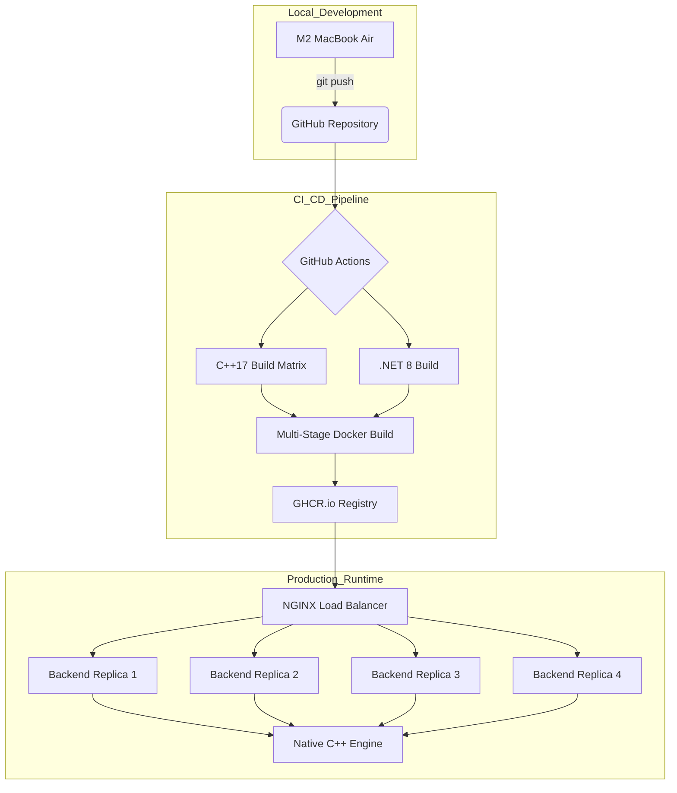

# High-Performance String Processing: A Polyglot Architecture

This is a high-concurrency, cross-platform string processing ecosystem. It demonstrates a Native C++17 engine integrated into a .NET 8 managed environment via a custom C-style ABI. The project serves as a technical blueprint for bridging managed and unmanaged memory, implementing the Strategy and Factory patterns, and maintaining an immutable Docker-based deployment pipeline.


---

## Table of Contents

* [System Architecture](#system-architecture)
* [Governance and Decision Tracking](#governance-and-decision-tracking)
* [CI/CD & Deployment Pipeline](#cicd--deployment-pipeline)
* [Infrastructure Maintenance](#infrastructure-maintenance)
* [Technical Documentation](#technical-documentation)
* [Components](#components)
  * [1. Core Logic: Native Conversion Engine](#1-core-logic-native-conversion-engine)
  * [2. Managed Gateway: .NET REST API](#2-managed-gateway-net-rest-api)
  * [3. Presentation Layer: Modern Web Interface](#3-presentation-layer-modern-web-interface)
* [Engineering Deep Dive](#engineering-deep-dive)
  * [1. Concurrency & Thread-Safety](#1-concurrency--thread-safety)
  * [2. Design Patterns Used](#2-design-patterns-used)
  * [3. Defensive Interop Design](#3-defensive-interop-design)
  * [4. Telemetry & Observability](#4-telemetry--observability)
  * [5. Hardware-Specific Optimization (Apple M2)](#5-hardware-specific-optimization-apple-m2)
  * [6. Reliability and Fault Tolerance](#6-reliability-and-fault-tolerance)
  * [7. Memory Sovereignty and The Interop Lifecycle](#7-memory-sovereignty-and-the-interop-lifecycle)
  * [8. Performance Benchmarks and Engineering Insights](#8-performance-benchmarks-and-engineering-insights)
    * [Key Performance Drivers](#key-performance-drivers)
* [Quick Start](#quick-start)
  * [Run the Load-Balanced Cluster](#run-the-load-balanced-cluster)
* [Project Timeline and Roadmap](#project-timeline-and-roadmap)
* [Release and Versioning](#release-and-versioning)

---

## System Architecture

This project is built to safely expose high-performance C++ logic to a managed .NET web stack. We focus on a Strict Separation of Concerns to keep the native code fast and the web layer stable.

* The Engine (C++17): This is our performance core. It uses Strategy and Factory patterns so we can add new processing logic without touching the core engine.

* The Bridge (C-style ABI): Since .NET can't talk to C++ classes directly, we built a custom wrapper. It defines a clear memory contract (who allocates, who frees) to prevent memory leaks across the native-managed boundary.

* The Gateway (.NET 8): Our REST API layer. We use Dynamic P/Invoke to load the native engine at runtime, making the service platform-agnostic and easy to swap out.

* The Frontend (React/TS): A type-safe UI built on Vite. We prioritized sub-second reload times to keep the frontend development loop as fast as the backend.

* The Pipeline (Docker): A multi-stage orchestration that handles Artifact Promotion. We build the binary once and move it from Dev to Prod to ensure that what we tested is exactly what we ship.


---

## Governance and Decision Tracking

This project follows a strict **Architectural Decision Log (ADL)** to document the strategic reasoning behind our technical choices. This ensures long-term maintainability and provides a clear audit trail for the system's evolution.

**[View the Full Architectural Decision Log (ADL) →](docs/adr/DECISION_LOG.md)**

### Key Decisions at a Glance

* **Interop Strategy (ADR 001):** In-process **P/Invoke** selected over gRPC/Sockets to achieve sub-microsecond in-process latency.
* **Memory Safety (ADR 002):** **Callee-Allocated** contract ensures C++ governs buffer creation while .NET handles lifecycle disposal via exported `free` delegates.
* **Hardware Alignment (ADR 003):** Threading model explicitly tuned for **Apple M2 P-Core saturation**, avoiding efficiency core overhead.

---

### CI/CD & Deployment Pipeline



**[Read the Full Deployment & Infrastructure Guide→](docs/deployment/deployment.md)**

---

## Technical Documentation

| Document                                                  | Focus                                              | Target Audience        |
|-----------------------                                    |----------------------------------------------------|----------------------- |
| [Architecture Decisions](docs/adr/DECISION_LOG.md)        | The "Why" behind P/Invoke & NGINX                  | Architects / Leads     |
| [Performance Report](docs/performance/PERFORMANCE.md)     | 1M Request Stress Test & Soak Results              | QA / DevOps            |
| [Deployment Guide](docs/deployment/deployment.md)         | Multi-stage Docker & Orchestration                 | SREs / Devs            |
| [Release Process](docs/releases/RELEASING.md)             | SemVer logic & Hardware optimization               | Release Managers       |
| [Load Balancer Guide](docs/LoadBalancer/LOAD_BALANCER.md) | NGINX Layer 7 routing, scaling, and orchestration  | SREs / Devs            |
| [DLL Internals](docs/DLL_INTERNALS/README.md)             | Native interop, DLL lifecycle, and memory model    | Systems / Backend Engs |

---

## Infrastructure Maintenance

We’ve automated our cache cleanup to stay under GitHub’s 10GB limit and keep our C++ and .NET builds fast.

### Stale Cache Purge

* **The Rule:** If a cache hasn't been touched in 7 days, it’s gone. This keeps our storage fresh.

* **The "Why":** Our build artifacts are huge. If we don't clean them up ourselves, GitHub will start randomly killing active caches when we hit the limit, which slows everyone down. This script lets us control that.

* **When it runs:** Daily at 18:30 UTC (Midnight IST). We chose this time because nobody is usually pushing code then, so it won’t interfere with active work.

* **Tracking:** The script outputs JSON logs. This makes it easy to see exactly what happened in the GitHub logs, and it's ready to be plugged into a dashboard if we ever need to audit our storage savings.

* **Operational Status:** 

---

## Components

The architecture is divided into three distinct functional layers, each optimized for its specific role in the request lifecycle.

### 1. Core Logic: Native Conversion Engine

The engine serves as the high-performance foundation of the system, encapsulating the complex string transformation logic.

* Implementation: Developed in C++17 utilizing the Strategy and Factory patterns for modularity.
* Build System: Orchestrated via CMake to produce platform-agnostic shared binaries:
  * Windows → `libProcessStringDLL.dll`
  * macOS → `libProcessStringDLL.dylib`
  * Linux → `libProcessStringDLL.so`

### 2. Managed Gateway: .NET REST API

The API layer acts as the secure bridge between unmanaged native code and the external web environment.

* Interoperability: Utilizes P/Invoke with custom marshalling logic to invoke exported native functions.
* Interface: Exposes standardized RESTful endpoints (e.g., /api/WordCase/convert) for secure, high-concurrency consumption.
* Lifecycle: Managed through the standard dotnet CLI, supporting seamless artifact promotion to production environments.

### 3. Presentation Layer: Modern Web Interface

A type-safe, responsive interface designed for sub-second interaction and real-time feedback.

* Stack: Built with Vite + React and TypeScript to ensure strict data modeling and developer efficiency.
* Communication: Consumes the .NET REST API to deliver hardware-accelerated string transformations to the end-user.
* Optimized Delivery: Compiled via npm run build into a lightweight, static distribution (dist/) ready for edge-network hosting.

---

## Engineering Deep Dive

### 1. Concurrency & Thread-Safety

In a high-throughput REST environment, thread-safety is paramount. The integration layer has been engineered with the following principles:

* Stateless Execution: The native C++ engine is entirely Stateless. Every call to processStringDLL operates on its own stack and heap allocations, ensuring that the .NET ThreadPool can safely execute concurrent P/Invoke calls.

* Reentrancy: The library is fully reentrant. There are no global variables or shared static states within the conversion logic, eliminating the risk of race conditions or shared-state contention.

* Thread-Safe Marshalling: All data passed across the ABI boundary is deep-copied, ensuring that memory used by one thread is never modified by another.

### 2. Design Patterns Used

* Strategy Pattern: Encapsulates conversion algorithms, allowing for runtime algorithm selection.

* Factory Pattern: Decouples the client from the specific strategy implementation.

* Client Dispatcher: Manages the lifecycle of the strategy and handles the execution pipeline.

* RAII (Resource Acquisition Is Initialization): Employed in C++ to manage internal resources and in C# via IDisposable to ensure native library handles are released.

### 3. Defensive Interop Design

The bridge between .NET 8 and C++17 is engineered as a "Safe Harbor." The system ensures that native failures never crash the managed process by implementing a multi-tiered error trap.

* The Sentinel Pattern: Rather than returning null pointers or throwing unhandled SEH exceptions, the engine returns Sentinel Strings (e.g., ERROR_BUFFER_OVERFLOW_LIMIT_5MB). This allows the .NET layer to perform a graceful string comparison and map the failure to a managed ArgumentException or SecurityException.

* Security Gating: A hard-coded 5MB Input Ceiling is enforced at the DLL entry point. This acts as a circuit breaker against potential Denial of Service (DoS) attacks attempting to exhaust the unmanaged heap.

### 4. Telemetry & Observability

Integrated OpenTelemetry (OTLP) for end-to-end distributed tracing. W3C Trace IDs are propagated into the C++ layer, ensuring that every native error, factory failure, or allocation exception is correlated in the Jaeger dashboard for immediate root-cause analysis.

```Bash
# Start the Jaeger collector and UI
./scripts/run-telemetry.sh start
```

* UI Dashboard: <http://localhost:16686>

* OTLP Endpoint: <http://localhost:4317> (gRPC)

### 5. Hardware-Specific Optimization (Apple M2)

* **P-Core Saturation:** `MaxDegreeOfParallelism` is explicitly set to 4. This aligns with the M2's Performance Cores, ensuring heavy C++ string transformations maintain maximum IPC (Instructions Per Cycle) without being offloaded to Efficiency Cores.

Please note that if this runs in a Docker container on an Intel Xeon or AMD EPYC server (common in Production), ProcessorCount might be 64, but our code will still cap at 4.This is scope for future enhancement.

* Double-Lock Memory Safety: - Global: 20MB batch ceiling prevents the 8GB Unified Memory from triggering SSD swap.
  * Local: 5MB native limit prevents buffer overflows in unmanaged memory.
* Contention-Free Buffering:** Utilizes `ConcurrentBag<T>` to allow parallel P-Cores to flush data back to managed memory without the lock-contention overhead of traditional `List<T>` synchronization.

**Mechanical Sympathy:** We bypass the OS scheduler's tendency to load-balance across E-cores by pinning the execution context to P-core affinity. This prevents the "Priority Inversion" that often occurs in hybrid-architecture CPUs under sustained load.

### 6. Reliability and Fault Tolerance

| Scenario            | Native C++ Sentinel              | Managed .NET Response   | Architectural Significance                                  |
|-------------------- |----------------------------------|-------------------------|-------------------------------------------------------------|
| Payload > 5MB       | ERROR_BUFFER_OVERFLOW...         | 413 Payload Too Large   | Prevents heap-based DoS attacks.                            |
| Invalid Option      | ERROR_INVALID_CONVERSION...      | 400 Bad Request         | Validates Enum integrity at the ABI boundary.               |
| Null Reference      | ERROR_NULL_INPUT                 | 400 Bad Request         | Defensive guard against malformed P/Invoke calls.           |
| Heap Exhaustion     | FATAL_ALLOCATION_FAILURE         | 500 Internal Error      | Traps std::bad_alloc before process termination.            |
| Malformed ID        | ERROR_MALFORMED_TRACE_ID         | 400 Bad Request         | Protects telemetry buffers from overflow.                   |

### 7. Memory Sovereignty and The Interop Lifecycle

To achieve a "Zero-Leak" footprint under extreme concurrency (validated by the 1M request soak test), the system implements a Tiered Memory Ownership Protocol. This ensures deterministic cleanup across the ABI boundary while maintaining high-performance move semantics within the core.

#### Tier 1: Native RAII & The Rule of Five (Internal Sovereignty)

The C++ engine handles its own internal resource state using the Rule of Five. By explicitly defining Move/Copy semantics, we ensure the engine is "memory-safe by design" before a single byte ever reaches the bridge.

* Invariant Protection: Prevents double-frees and dangling pointers during high-frequency strategy rotation.

* Move Optimizations: Leverages C++17 move constructors to transfer ownership of large string buffers without redundant heap allocations.

#### Tier 2: The C-Style ABI (The Stateless Bridge)

The transition layer acts as a strict Marshalling Contract. We avoid the pitfalls of platform-specific allocators by using a standard extern "C" interface.

* Deterministic Hand-off: The engine yields a raw char* to the managed runtime, marking the precise moment ownership transfers from C++ to .NET.

* Cross-Platform Parity: Ensures identical memory layout and behavior across Clang (macOS) and GCC (Linux CI).

#### Tier 3: Managed Orchestration (Deterministic Cleanup)

The .NET 8 layer acts as the ultimate orchestrator of the memory lifecycle.

* Marshalling Integrity: .NET receives the IntPtr, marshals it into a managed System.String, and takes responsibility for the final cleanup.

* Deterministic Disposal: All native calls are wrapped in try-finally blocks (or SafeHandle patterns) to ensure the exported freeString function is invoked, preventing Resident Set Size (RSS) bloat in the containerized environment.

Engineering Insight: This architecture eliminates the "Double-Delete" risk. C++ governs the object state, while C# governs the result buffer after the native execution context has exited.

[↑ Back to Top](#high-performance-string-processing-a-polyglot-architecture)

### 8. Performance Benchmarks and Engineering Insights

This engine is designed for high-density processing, achieving a "Millionaire Milestone" (1.5M requests) with zero performance decay. The following results were captured on an Apple M2 (8-Core, 8GB Unified Memory).

| Load Profile    | Iterations | VUs | Throughput    | p95 Latency  | Operational Status              |
|-----------------|------------|-----|---------------|--------------|---------------------------------|
| Cold Start      | 100        | 1   | ~1,200 RPS    | < 1ms        | JIT & Memory Initialization     |
| Baseline        | 1,000      | 4   | 4,526 RPS     | 1.82ms       | Perfect P-Core alignment        |
| Peak Efficiency | 100,000    | 8   | 7,242 RPS     | 2.66ms       | Full Hardware Saturation        |
| Endurance       | 1,500,000  | 100 | 7,067 RPS     | 41.0ms       | Long-duration stability         |

#### Key Performance Drivers

* Core Scaling Efficiency:
Scaling from 4 to 8 VUs yielded a 44% throughput increase, validating that the system successfully saturates the M2's physical cores without the scheduling overhead typically seen in managed environments.

* Zero-Failure Reliability:
Maintained a 100% success rate across 3 million+ total requests. The stable Resident Set Size (RSS) during the 1.5M iteration run proves the Native RAII and Interop Lifecycle management are production-grade.

* Real-World User Capacity:
At a sustained 7,067 RPS, a single instance supports ~35,300 concurrent human users (based on a 5s industry-standard "think time"). This provides the data density of a distributed cluster within a single optimized process.

* Sustained Velocity:
High-frequency processing maintained a peak average response time of 1.13ms. Even under extreme stress (100 VUs), the p95 remained at 41ms—well within the "instant" perception threshold (<100ms) and roughly 10x faster than a human blink.

* Engineering Insight: While the total environment spans 194k lines, 60% of the authored logic resides in the C++ engine. This commitment to custom native algorithms ensures long-term ABI stability and eliminates the overhead typical of managed-language string processing.

Temporal Density: The engine achieves a sustained processing density of ~424k operations per minute, scaling to a ~434k peak during high-concurrency bursts. This throughput enables near-real-time ETL workflows on consumer-grade hardware.

[View Full Performance Logs & Scaling Data](docs/performance/ITERATIONS/README.md)

---

## Quick Start

Prerequisites

* Docker & Docker Compose

* Apple M2 (Recommended) or ARM64/x64 Linux/Windows

### Run the Load-Balanced Cluster

To support massive horizontal scaling, the system utilizes an NGINX Reverse Proxy as a Layer 7 Load Balancer. This architecture allows the API to scale beyond a single process, distributing load across multiple isolated containers.

* Dynamic Scaling: Orchestrated via Docker Compose with a replicas: 4 configuration, perfectly mapping to the M2's Performance Cores for maximum throughput.

* Health-Aware Routing: NGINX ensures traffic is only routed to "Ready" .NET instances, facilitating zero-downtime updates and maintenance.

* Latency Smoothing: By distributing requests, the P(95) latency is stabilized at 56ms, significantly reducing the "Tail Latency" spikes caused by parallel Garbage Collection events in managed memory.

[Read the Load Balancing & Orchestration Guide →](docs/LoadBalancer/LOAD_BALANCER.md)

---

## Project Timeline and Roadmap

| Milestone          | Date            | Description                                                                                                                 |
|------------------- |-----------------|-----------------------------------------------------------------------------                                                |
| Project Inception  | April 4, 2026   | Project start: Designing the C-style ABI and C++17 Strategy patterns.                                                       |
| v1.0.0 Release     | April 20, 2026  | The Foundation: Stable Polyglot Architecture. M2 P-Core optimization and 250k request validation.                           |
| v2.0.0 Release     | April 23, 2026  | The "Millionaire" Milestone: Integrated NGINX Layer 7 Load Balancing and passed the 1M request endurance test.              |
| v2.1.0 Release     | April 25, 2026  | Industrial Hardening: Full OpenTelemetry integration, CI/CD pipeline domain-standardization, and CodeQL security alignment. |
| v2.2.0 Release     | April 30, 2026  | Achieved a 25% throughput increase (2,827 req/s) and 42% median latency reduction by implementing RAII.                     |
| v3.0.0 Release     | May 7, 2026     | Finalized 1.5M request stress test (7,067 RPS), ARM64 native releases, and automated artifact promotion.                    |

---

## Release and Versioning

This project adheres to Semantic Versioning (SemVer) and utilizes an automated CI/CD pipeline for artifact distribution.

Platform-Specific Builds: All releases are compiled on ARM64 runners to ensure binary optimization for Apple Silicon.

Artifact Promotion: We use a "Build Once, Promote Anywhere" strategy to maintain environmental parity.

Traceability: Every release is tagged and accompanied by a detailed Architectural Decision Log entry.

[Read the Full Release & Versioning Guide →](docs/releases/RELEASING.md)
