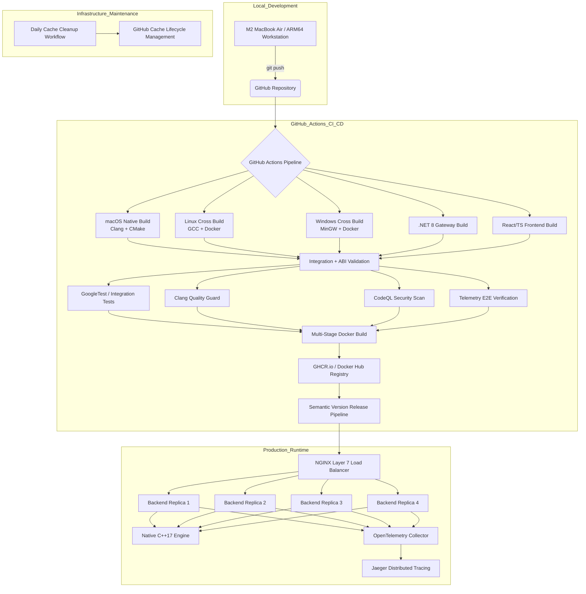

# High-Performance String Processing: A Polyglot Architecture

This project is a high-concurrency, cross-platform string processing and spell-check service system engineered around a native C++17 execution core integrated with a .NET 8 managed runtime through a custom C-style ABI layer. The architecture demonstrates low-level managed/unmanaged interoperability, deterministic memory ownership, and scalable service orchestration while applying Strategy and Factory design patterns within an immutable Docker-driven deployment pipeline.


---

## Table of Contents

* [Why This Exists](#why-this-exists)
* [System Architecture](#system-architecture)
* [Governance and Decision Tracking](#governance-and-decision-tracking)
* [CI/CD & Deployment Pipeline](#cicd--deployment-pipeline)
* [Infrastructure Maintenance](#infrastructure-maintenance)
* [Technical Documentation](#technical-documentation)
* [Components](#components)
  * [1. Core Logic: Native Conversion Engine](#1-core-logic-native-conversion-engine)
  * [2. Managed Gateway: .NET REST API](#2-managed-gateway-net-rest-api)
  * [3. Presentation Layer: Modern Web Interface](#3-presentation-layer-modern-web-interface)
* [Engineering Deep Dive](#engineering-deep-dive)
  * [1. Concurrency & Thread-Safety](#1-concurrency--thread-safety)
  * [2. Design Patterns Used](#2-design-patterns-used)
    * [Architectural and Interop Patterns](#architectural-and-interop-patterns)
    * [Native Execution Core (C++17)](#native-execution-core-c17)
    * [Managed Infrastructure (.NET 8)](#managed-infrastructure-net-8)
  * [3. Defensive Interop Design](#3-defensive-interop-design)
  * [4. Telemetry & Observability](#4-telemetry--observability)
  * [5. Hardware-Specific Optimization (Apple M2)](#5-hardware-specific-optimization-apple-m2)
  * [6. Reliability and Fault Tolerance](#6-reliability-and-fault-tolerance)
  * [7. Native-to-Managed Memory Ownership Model](#7-native-to-managed-memory-ownership-model)
  * [8. Performance Benchmarks and Engineering Insights](#8-performance-benchmarks-and-engineering-insights)
    * [Key Performance Drivers](#key-performance-drivers)
  * [9. The Challenge of Native Compilation on Apple Silicon](#9-the-challenge-of-native-compilation-on-apple-silicon)
  * [10. Automated PR Workflow (Local Orchestration)](#10-automated-pr-workflow-local-orchestration)
* [Quick Start](#quick-start)
  * [Run the Load-Balanced Cluster](#run-the-load-balanced-cluster)
* [Project Timeline and Roadmap](#project-timeline-and-roadmap)
* [Release and Versioning](#release-and-versioning)

---

## Why This Exists

Most string-processing APIs are implemented entirely in managed runtimes.
This project explores a hybrid architecture where high-performance native C++17
processing is exposed safely through a modern .NET 8 web stack using a custom
C-style ABI layer.

The goal is to demonstrate:

* Safe managed/unmanaged interoperability
* Deterministic memory ownership
* Cross-platform native compilation
* High-concurrency REST orchestration
* Production-grade observability and deployment

---

## System Architecture

This project is built to safely expose high-performance C++ logic to a managed .NET web stack. We focus on a clear separation between native processing, API orchestration, and frontend delivery to keep the native code fast and the web layer stable.

* The Engine (C++17): This is our performance core. It uses Strategy and Factory patterns so we can add new processing logic without touching the core engine.

* The Bridge (C-style ABI): Since .NET can't talk to C++ classes directly, we built a custom wrapper. It defines a clear memory contract (who allocates, who frees) to prevent memory leaks across the native-managed boundary.

* The Gateway (.NET 8): Our REST API orchestration layer. We use Dynamic P/Invoke to load the native engine at runtime, making the service platform-agnostic and easy to swap across operating systems. The managed layer also utilizes the Singleton pattern for shared runtime services such as native library loaders, configuration providers, and telemetry orchestration to ensure centralized lifecycle management and reduced allocation overhead under high concurrency.

* The Frontend (React/TS): A type-safe UI built on Vite. We prioritized sub-second reload times to keep the frontend development loop as fast as the backend.

* The Pipeline (Docker): A multi-stage orchestration pipeline supporting immutable deployments. We build the binary once and promote the same artifact from Development to Production, ensuring environmental consistency and deployment reproducibility.


---

## Governance and Decision Tracking

This project follows a strict **Architectural Decision Log (ADL)** to document the strategic reasoning behind our technical choices. This ensures long-term maintainability and provides a clear audit trail for the system's evolution.

**[View the Full Architectural Decision Log (ADL) →](docs/adr/DECISION_LOG.md)**

### Key Decisions at a Glance

* **Interop Strategy (ADR 001):** In-process **P/Invoke** selected over gRPC/Sockets to achieve sub-microsecond in-process latency.
* **Memory Safety (ADR 002):** **Callee-Allocated** contract ensures C++ governs buffer creation while .NET handles lifecycle disposal via exported `free` delegates.
* **Hardware Alignment (ADR 003):** Threading model explicitly tuned for **Apple M2 P-Core saturation**, avoiding efficiency core overhead.

---

### CI/CD & Deployment Pipeline



**[Read the Full Deployment & Infrastructure Guide→](docs/deployment/deployment.md)**

---

## Technical Documentation

| Document                                                  | Focus                                                      | Target Audience              |
|-----------------------------------------------------------|------------------------------------------------------------|----------------------------- |
| [Architecture Decisions](docs/adr/DECISION_LOG.md)        | Architectural rationale behind P/Invoke and NGINX design   | Architects / Technical Leads |
| [Performance Report](docs/performance/PERFORMANCE.md)     | Stress testing, soak testing, and throughput analysis      | QA Engineers / DevOps        |
| [Deployment Guide](docs/deployment/deployment.md)         | Multi-stage Docker deployment and orchestration            | SREs / Platform Engineers    |
| [Release Process](docs/releases/RELEASING.md)             | Semantic Versioning and release optimization strategy      | Release Managers             |
| [Load Balancer Guide](docs/LoadBalancer/LOAD_BALANCER.md) | NGINX Layer 7 routing, scaling, and traffic orchestration  | SREs / Platform Engineers    |
| [DLL Internals](docs/DLL_INTERNALS/README.md)             | Native interop, DLL lifecycle, and memory ownership model  | Systems / Backend Engineers  |

---

## Infrastructure Maintenance

To maintain predictable CI/CD performance and remain within GitHub’s 10GB cache quota, the project implements an automated cache lifecycle management workflow for C++ and .NET build artifacts.

### Stale Cache Purge

* **Retention Policy:** Cache entries that have not been accessed for 7 consecutive days are automatically removed to preserve active storage capacity.

* **Operational Rationale:** Native compilation artifacts and container layers consume significant storage space. Proactive cache eviction prevents GitHub from automatically purging frequently used caches when storage thresholds are exceeded, ensuring stable and predictable build performance.

* **Execution Schedule:** The cleanup workflow executes daily at 18:30 UTC (00:00 IST) during low-development activity periods to minimize interference with active CI/CD operations.

* **Observability & Auditability:** The workflow emits structured JSON logs for traceability and operational auditing. These logs can also be integrated into external monitoring or storage analytics dashboards.

* **Operational Status:** 

---

## Components

The system architecture is divided into distinct functional layers, each optimized for a specific responsibility within the request-processing lifecycle.

### 1. Core Logic: Native Conversion Engine

The native engine serves as the high-performance execution core of the platform, encapsulating the string transformation and spell-check processing logic.

* **Implementation:** Developed in C++17 using the Strategy and Factory patterns to support modular algorithm selection and extensibility.
* **Build System:** Managed through CMake to generate platform-specific shared libraries:
  * Windows → `libProcessStringDLL.dll`
  * macOS → `libProcessStringDLL.dylib`
  * Linux → `libProcessStringDLL.so`

#### Native Build Orchestration

To maintain deterministic CI/CD behavior across platforms, the project uses a centralized orchestration script. The workflow performs native compilation on macOS while delegating Linux and Windows builds to containerized toolchains.

[Orchestrator Script](backend/CaseConversionAPI/scripts/orchestrate-native-docker.sh)

```Bash
# LOCAL MACOS BUILD ---
NATIVE_SCRIPT_REL="backend/CaseConversionAPI/CppLib/Scripts/orchestrate-native.sh"
```

#### Multi-Platform Docker Toolchain

The cross-compilation environment is encapsulated in a multi-stage Dockerfile. This ensures that the Linux .so and Windows .dll (via MinGW) are built in a clean, reproducible environment before being exported back to the host.

```Bash
# DOCKER CROSS-BUILD (LINUX & WINDOWS) ---
DOCKERFILE_PATH="backend/CaseConversionAPI/CppLib/Scripts/Dockerfile"
```

| Target | Format   | Toolchain      | Environment          |
|--------|----------|----------------|--------------------  |
| macOS  | `.dylib` | Clang / CMake  | Local M2 (Native)    |
| Linux  | `.so`    | GCC / CMake    | Docker (Ubuntu)      |
| Windows| `.dll`   | MinGW / CMake  | Docker (Cross-Build) |

### 2. Managed Gateway: .NET REST API

The .NET 8 API layer functions as the managed orchestration boundary between the native C++ execution engine and external client applications.

* **Interoperability:** Utilizes Dynamic P/Invoke with custom marshalling logic to invoke exported native functions through a stable C-style ABI interface.
* **API Surface:** Exposes standardized RESTful endpoints (e.g., `/api/WordCase/convert`) designed for secure, high-concurrency request processing.
* **Runtime Architecture:** Implements Singleton-based service orchestration for shared runtime components such as native library loaders, telemetry providers, and configuration management.
* **Deployment Lifecycle:** Managed through the standard `dotnet` CLI and integrated into a staged Docker-based CI/CD deployment pipeline.

### 3. Presentation Layer: Modern Web Interface

The frontend layer provides a responsive, type-safe interface optimized for low-latency interaction and real-time processing feedback.

* **Frontend Stack:** Built with Vite, React, and TypeScript to enforce strict type safety, predictable state management, and rapid development iteration cycles.
* **Service Communication:** Consumes the .NET REST API to deliver high-performance string transformation and spell-check services to end users.
* **Optimized Delivery:** Compiled using `npm run build` into a lightweight static distribution (`dist/`) suitable for containerized deployment and edge-network hosting.

---

## Engineering Deep Dive

### 1. Concurrency & Thread-Safety

In a high-throughput REST environment, thread safety is critical. The integration layer is engineered around deterministic execution, reentrant native processing, and isolated memory ownership to ensure stable behavior under extreme concurrency.

* Stateless Execution: The native C++ engine is fully stateless. Every invocation of processStringDLL operates on independent stack and heap allocations, allowing the .NET ThreadPool to execute concurrent P/Invoke calls safely without shared-state contention.

* Reentrant Native Design: The library is completely reentrant and avoids global variables, mutable static state, and shared runtime buffers. This eliminates race conditions and enables safe parallel execution across multiple worker threads.

* Thread-Safe Marshalling: All data crossing the managed/unmanaged ABI boundary is deep-copied before processing. This guarantees that memory owned by one execution context cannot be mutated by another concurrent request.

* Singleton-Orchestrated Runtime Services (.NET 8): The managed gateway uses Singleton-scoped infrastructure services for shared orchestration concerns such as telemetry pipelines, configuration management, native library loading, and lifecycle coordination. This minimizes runtime allocation overhead while preserving thread-safe access patterns within the ASP.NET Core hosting model.

* Concurrency Isolation: Each request maintains an isolated execution path from HTTP ingress to native processing and response serialization. No shared mutation occurs between concurrent requests, enabling predictable scaling behavior under sustained load.

### 2. Design Patterns Used

The system applies multiple architectural and behavioral design patterns to maintain modularity, extensibility, and deterministic resource management across both native and managed runtimes.

#### Architectural and Interop Patterns

* Bridge Pattern (Interop Layer): Decouples the managed .NET abstraction from the native C++ implementation. This allows the high-level API service to evolve independently of the low-level ABI, enabling seamless swaps between different native engines (e.g., Clang vs. MSVC compiled binaries) without breaking the service contract.

* Proxy Pattern (Service Orchestration): The ProcessStringService acts as a managed proxy for the unmanaged DLL. It encapsulates the complexity of platform-specific library loading, symbol resolution, and marshaling, providing a clean, idiomatic C# interface to external consumers.

* Circuit Breaker Pattern (Fault Tolerance): Implemented within the managed gateway to protect the ASP.NET Core host process. By monitoring native execution health, the circuit breaker can preemptively "trip" during native heap exhaustion or engine instability, preventing cascading failures and ensuring a deterministic fallback path.

#### Native Execution Core (C++17)

* Strategy Pattern: Encapsulates individual string transformation algorithms behind a common interface, enabling runtime selection of conversion behaviors without modifying the execution pipeline.

* Factory Pattern: Centralizes strategy creation and decouples the client layer from concrete implementation details, simplifying extensibility and reducing dependency coupling.

* RAII (Resource Acquisition Is Initialization): Applied throughout the C++17 engine to guarantee deterministic cleanup of unmanaged resources through scoped object lifetimes and automatic destructor execution.

#### Managed Infrastructure (.NET 8)

* Singleton Pattern (.NET 8): Shared infrastructure services such as telemetry providers, configuration loaders, native library managers, and orchestration services are registered as Singleton instances within the ASP.NET Core dependency injection container to ensure centralized lifecycle control and reduced allocation overhead.

* IDisposable / SafeHandle Pattern (.NET): The managed layer uses IDisposable, try/finally, and SafeHandle-oriented cleanup semantics to ensure deterministic release of unmanaged buffers and native library handles acquired through P/Invoke.

* Client Dispatcher: Coordinates request execution, strategy lifecycle management, validation flow, and dispatch orchestration between managed and unmanaged layers.

### 3. Defensive Interop Design

The interoperability layer between .NET 8 and the native C++17 engine is engineered as a defensive execution boundary designed to preserve managed runtime stability under all failure scenarios. The architecture prevents unmanaged faults from propagating into the ASP.NET Core process through strict validation, deterministic error handling, and controlled memory ownership.

* The Sentinel Pattern: Instead of returning null pointers or allowing unhandled SEH exceptions to cross the ABI boundary, the native engine returns deterministic sentinel responses (e.g., ERROR_BUFFER_OVERFLOW_LIMIT_5MB). The .NET layer performs controlled validation against these responses and maps them into managed exceptions such as ArgumentException, SecurityException, or standardized HTTP error responses.

* Security Gating: A hard-coded 5MB payload ceiling is enforced directly at the native DLL entry point. This acts as a defensive circuit breaker against malformed payloads, uncontrolled heap allocation, and potential Denial-of-Service (DoS) attempts targeting unmanaged memory exhaustion.

* ABI Boundary Validation: All inbound parameters crossing the managed/unmanaged boundary undergo strict validation before native execution begins. This includes null checking, conversion option validation, payload size verification, and telemetry identifier integrity checks.

* Deterministic Memory Ownership: The interop layer follows a clearly defined ownership contract in which native memory allocation and managed disposal responsibilities are explicitly separated. This prevents double-free conditions, dangling pointers, and allocator mismatch issues across runtime boundaries.

* Crash Containment Strategy: Native allocation failures, invalid state transitions, and internal processing faults are intercepted within the unmanaged layer and converted into controlled failure responses. This prevents native exceptions from destabilizing the ASP.NET Core host process.

* Cross-Platform ABI Stability: The exported extern "C" interface maintains deterministic binary compatibility across Clang, GCC, and MinGW toolchains, ensuring consistent marshaling behavior between macOS, Linux, and Windows deployment environments.

### 4. Telemetry & Observability

The platform integrates OpenTelemetry (OTLP) to provide end-to-end distributed tracing across the managed .NET runtime, native C++ execution layer, and containerized deployment environment. The observability pipeline is designed to maintain full request correlation across interop boundaries for rapid diagnostics and production-grade monitoring.

* Distributed Trace Propagation: W3C Trace Context identifiers are propagated from the ASP.NET Core request pipeline into the native C++ execution layer, enabling complete trace continuity across managed and unmanaged runtimes.

* Native Error Correlation: Allocation failures, strategy initialization faults, sentinel-triggered exceptions, and interop validation failures are emitted as correlated telemetry events, allowing precise root-cause analysis within Jaeger.

* OpenTelemetry Integration (.NET 8): The managed gateway uses OpenTelemetry instrumentation for request tracing, execution timing, service correlation, and runtime diagnostics while exporting telemetry through OTLP-compatible collectors.

* Centralized Observability Pipeline: Telemetry data is aggregated through the OTLP collector and visualized in Jaeger, enabling real-time inspection of request flow, latency distribution, service dependencies, and failure propagation.

* Low-Overhead Instrumentation: The tracing pipeline is engineered to minimize runtime overhead during high-concurrency execution, ensuring observability does not materially impact throughput or latency characteristics.
Operational Endpoints:
  * Jaeger UI Dashboard: <http://localhost:16686>
  * OTLP gRPC Endpoint: <http://localhost:4317>

* Production Diagnostics: Distributed tracing enables rapid identification of performance bottlenecks, native execution hotspots, interop failures, and container-level service degradation during sustained load conditions.

### 5. Hardware-Specific Optimization (Apple M2)

The execution model is explicitly tuned for Apple Silicon, with optimization strategies focused on maximizing Performance Core utilization, minimizing scheduler contention, and preserving deterministic memory behavior under sustained high-concurrency workloads.

* **P-Core Saturation:** MaxDegreeOfParallelism is intentionally capped at 4, aligning execution with the Apple M2’s four high-performance cores. This ensures compute-intensive C++ string transformations maintain maximum IPC (Instructions Per Cycle) without being migrated to lower-frequency Efficiency Cores.

* Controlled Parallelism Model: Even when deployed inside high-core-count environments such as Intel Xeon or AMD EPYC servers, the runtime currently preserves the fixed parallelism ceiling of four execution threads. This maintains predictable scheduling behavior and avoids uncontrolled thread amplification, though adaptive scaling remains a planned future enhancement.

* Hybrid-Architecture Awareness: The execution strategy is optimized specifically for heterogeneous CPU architectures where Performance and Efficiency cores coexist. By favoring P-Core affinity, the system minimizes scheduler-induced latency variance commonly observed in hybrid-core systems under sustained load.

* Double-Lock Memory Safety: - The runtime enforces a two-tier memory safety model designed to protect both managed and unmanaged memory regions:
  * Global Managed Ceiling: A 20MB batch-processing ceiling prevents excessive Unified Memory pressure and reduces the likelihood of SSD swap activation on 8GB Apple Silicon systems.

  * Native Allocation Ceiling: A strict 5MB unmanaged payload limit is enforced at the DLL boundary to mitigate buffer overflow risks and prevent uncontrolled native heap growth.
* Contention-Free Buffering: The managed orchestration layer utilizes `ConcurrentBag<T>` for parallel result aggregation, eliminating the synchronization bottlenecks and lock contention commonly associated with shared `List<T>` mutation under multi-threaded workloads.

* P-Core Optimized Execution Affinity: The scheduling model minimizes OS-level load balancing across Efficiency Cores by maintaining execution affinity toward high-performance compute paths. This reduces the probability of priority inversion and improves latency consistency during sustained concurrent execution.

* Low-Latency Throughput Stability: Hardware-aware orchestration enables the platform to maintain stable throughput and predictable latency characteristics during long-duration stress workloads while operating within the thermal and memory constraints of consumer-grade ARM64 hardware.

### 6. Reliability and Fault Tolerance

The platform is engineered around a fail-safe execution model designed to preserve runtime stability under malformed input, unmanaged allocation failures, and high-concurrency edge conditions. Native failures are isolated at the interoperability boundary and translated into deterministic managed responses to prevent process-level instability.

| Failure Scenario    | Native C++ Sentinel              | Managed .NET Response   | Architectural Significance                                  |
|-------------------- |----------------------------------|-------------------------|-------------------------------------------------------------|
| Payload > 5MB       | ERROR_BUFFER_OVERFLOW...         | 413 Payload Too Large   | Prevents heap-based DoS attacks.                            |
| Invalid Option      | ERROR_INVALID_CONVERSION...      | 400 Bad Request         | Validates Enum integrity at the ABI boundary.               |
| Null Reference      | ERROR_NULL_INPUT                 | 400 Bad Request         | Defensive guard against malformed P/Invoke calls.           |
| Heap Exhaustion     | FATAL_ALLOCATION_FAILURE         | 500 Internal Error      | Traps std::bad_alloc before process termination.            |
| Malformed ID        | ERROR_MALFORMED_TRACE_ID         | 400 Bad Request         | Protects telemetry buffers from overflow.                   |

### 7. Native-to-Managed Memory Ownership Model

To maintain a near zero-leak execution profile under sustained high concurrency, the platform implements a tiered memory ownership architecture that defines explicit allocation, transfer, and disposal responsibilities across the managed/unmanaged boundary. This model enables deterministic cleanup semantics while preserving the performance advantages of native C++17 move operations.

#### Tier 1: Native RAII & Rule of Five (Internal Resource Sovereignty)

The native C++17 engine governs its internal memory lifecycle using RAII principles and explicit Rule of Five implementations. This ensures unmanaged resources remain deterministic, exception-safe, and ownership-aware before crossing the ABI boundary.

* Invariant Protection: Explicit move/copy constructors and assignment operators prevent double-free conditions, dangling pointers, and invalid ownership transfer during high-frequency strategy execution.

* Move-Semantic Optimization: Large string buffers are transferred using C++17 move semantics to eliminate unnecessary heap duplication and reduce allocation overhead under parallel workloads.

* Scoped Resource Lifetime: Internal buffers, conversion strategies, and execution resources are automatically reclaimed through deterministic destructor execution tied to object scope.

#### Tier 2: Stable C-Style ABI Boundary (Interop Transfer Layer)

The interoperability layer exposes a stable extern "C" ABI to bridge managed .NET execution with the native engine while avoiding allocator mismatch risks across runtimes and toolchains.

* Deterministic Ownership Transfer: The native engine allocates and returns an owned char* result buffer to the managed runtime, defining a precise ownership transition point between C++ and .NET.

* Allocator Isolation: Memory allocation and deallocation responsibilities remain bound to the originating runtime, preventing cross-runtime heap corruption and undefined allocator behavior.

* Cross-Platform ABI Consistency: The exported interface maintains deterministic binary compatibility across Clang (macOS), GCC (Linux), and MinGW (Windows) toolchains.

#### Tier 3: Managed Runtime Orchestration (.NET 8)

The ASP.NET Core gateway assumes responsibility for marshaling, lifecycle management, and deterministic release of unmanaged buffers after native execution completes.

* Marshalling Integrity: The managed layer receives the native IntPtr, converts it into a managed System.String, and isolates the result from unmanaged memory before disposal occurs.

* Deterministic Cleanup Semantics: Native allocations are released through exported cleanup delegates using try/finally, IDisposable, and SafeHandle-oriented disposal patterns to guarantee resource reclamation even during exception paths.

* Container Memory Stability: Deterministic disposal prevents unmanaged Resident Set Size (RSS) growth during long-duration stress workloads and sustained containerized execution.

Engineering Insight: This ownership architecture eliminates allocator ambiguity and significantly reduces the risk of double-delete conditions, dangling references, and unmanaged memory leaks. The native runtime governs object state and allocation semantics, while the managed runtime governs result marshaling and final disposal after the execution context exits.
The result is a deterministic interoperability model capable of sustaining extreme request concurrency while maintaining stable memory characteristics across macOS, Linux, and Windows deployment environments.

[↑ Back to Top](#high-performance-string-processing-a-polyglot-architecture)

### 8. Performance Benchmarks and Engineering Insights

This engine is engineered for high-density concurrent processing and long-duration workload stability, successfully completing a 1.5 million request endurance test without measurable throughput degradation during the execution window. The benchmark environment was executed on an Apple M2 (8-Core, 8GB Unified Memory) platform optimized for P-Core aligned execution.

| Load Profile    | Iterations | VUs | Throughput    | p95 Latency  | Operational Status              |
|-----------------|------------|-----|---------------|--------------|---------------------------------|
| Cold Start      | 100        | 1   | ~1,200 RPS    | < 1ms        | JIT & Memory Initialization     |
| Baseline        | 1,000      | 4   | 4,526 RPS     | 1.82ms       | Perfect P-Core alignment        |
| Peak Efficiency | 1,000,000  | 8   | 7,242 RPS     | 2.66ms       | Full Hardware Saturation        |
| Endurance       | 1,500,000  | 100 | 7,067 RPS     | 41.0ms       | Long-duration stability         |

#### Key Performance Drivers

* Core Scaling Efficiency: Scaling from 4 to 8 VUs produced a 44% throughput increase, demonstrating efficient saturation of the Apple M2 Performance Cores while avoiding the scheduling overhead commonly observed in managed runtimes.

* Zero-Failure Reliability: The platform maintained a 100% success rate across more than 3 million total requests. Stable Resident Set Size (RSS) metrics throughout the 1.5M-request endurance run validate the effectiveness of the Native RAII lifecycle and managed/unmanaged memory orchestration under sustained stress conditions.

* Real-World User Capacity: At a sustained throughput of 7,067 RPS, a single deployment instance can theoretically support approximately 35,000 active client sessions under a synthetic workload model using a 5-second industry-standard client think time.

* Sustained Velocity: High-frequency processing maintained an average peak response time of 1.13ms. Even under maximum stress conditions (100 VUs), p95 latency remained at 41ms, well below the widely accepted “instant-response” threshold of 100ms.

* Engineering Insight: Although the broader ecosystem spans approximately 194k lines of code, nearly 60% of the authored logic resides within the native C++ engine. This architectural emphasis on native execution paths preserves ABI stability, minimizes managed-runtime overhead, and enables deterministic high-throughput string processing.

* Sustained Throughput Under Concurrent Load: The platform sustained an average processing density of approximately 424k operations per minute, peaking near 434k operations per minute during high-concurrency bursts. This level of throughput enables near-real-time ETL and transformation workloads on consumer-grade ARM64 hardware.

[View Full Performance Logs & Scaling Data](docs/performance/ITERATIONS/README.md)

### 9. The Challenge of Native Compilation on Apple Silicon

Building cross-platform native binaries on modern Apple Silicon systems (M1/M2/M3) introduces several platform and toolchain compatibility constraints that make unified native compilation significantly more complex than a traditional single-platform build workflow.

* The Mach-O vs. ELF vs. PE Barrier: macOS uses the Mach-O executable format, Linux uses ELF, and Windows uses PE (Portable Executable). Native Clang toolchains on macOS are tightly coupled to the Apple SDK and linker environment. While cross-compilers are available, they frequently require dedicated sysroots and platform-specific runtime libraries to correctly resolve Linux and Windows headers, linkers, and binary dependencies.

* Instruction Set Divergence: Apple M-series processors operate on the ARM64 (AArch64) architecture, whereas most production-grade Linux servers still target x86_64 (Intel/AMD). As a result, building a Linux .so inside a standard Docker container on macOS will often generate ARM64 binaries by default. Producing x86_64-compatible artifacts requires either QEMU-based emulation or dedicated cross-compilation toolchains such as x86_64-linux-gnu-gcc, both of which introduce additional orchestration and maintenance complexity.

* Docker's Virtualization Layer: Docker Desktop on macOS operates within a lightweight Linux virtual machine rather than directly on the host operating system. Consequently, containers have no direct access to Apple system frameworks, native SDKs, or Mach-O build tooling. This architectural separation prevents macOS .dylib binaries from being compiled entirely within Docker-based Linux environments.

* Hybrid Build Orchestration Strategy: To address these constraints, the project adopts a hybrid orchestration model. Native macOS .dylib artifacts are compiled directly on the Apple Silicon host using Clang and the Apple SDK, while Linux (.so) and Windows (.dll) targets are generated inside isolated Docker-based cross-compilation environments. This approach preserves platform correctness, reproducibility, and CI/CD consistency across all supported operating systems.

**Architectural Solution:**
We solved this by using a Hybrid Orchestration Strategy. The Mac host handles the .dylib (Native M2 P-Core optimization), while the Docker VM handles the Linux and Windows toolchains in an isolated, reproducible environment.

[Native Build Orchestration](#native-build-orchestration)

### 10. Automated PR Workflow (Local Orchestration)

To maintain architectural integrity and enforce standardizations across the polyglot codebase, the project utilizes a custom GitHub PR Automator ([gh-automate.sh](scripts/gh-automate.sh)). This tool abstracts the complexity of branch management, CI/CD monitoring, and administrative merging into a single execution context.

#### Workflow Features

* Atomic Standardization: Automatically stages all metadata and core changes to ensure documentation never drifts from implementation.

* CI/CD Verification Gate: Leverages the GitHub CLI to stream live status checks (Actions, CodeQL, Security Audits) directly to the terminal.

* Administrative Cleanup: Executes squash-merges and performs local/remote branch pruning to maintain a clean, linear git history.

#### Usage

```Bash
./scripts/gh-automate.sh <branch-name> "<message>"
```

---

## Quick Start

Prerequisites

Before running the platform locally, ensure the following dependencies are available:

* Docker & Docker Compose
* Apple Silicon (M1/M2/M3 Recommended) or ARM64/x64 Linux/Windows environments
* .NET 8 SDK (optional for local development)
* CMake and Clang/GCC toolchains (required for native builds outside Docker)

### Run the Load-Balanced Cluster

To support high-concurrency workloads and horizontal scalability, the platform utilizes an NGINX Reverse Proxy operating as a Layer 7 Load Balancer. This architecture enables request distribution across multiple isolated backend containers while maintaining stable latency characteristics under sustained load.

* Dynamic Scaling: Container orchestration is managed through Docker Compose using a replicas: 4 deployment model. On Apple M2 systems, this configuration aligns closely with the available Performance Cores, maximizing throughput efficiency during concurrent request execution.

* Health-Aware Routing: NGINX routes traffic exclusively to healthy .NET 8 backend instances, enabling graceful failover behavior, rolling deployments, and zero-downtime service maintenance.

* Latency Smoothing: By distributing workloads across multiple backend replicas, the system minimizes tail-latency spikes commonly caused by parallel Garbage Collection events and managed-runtime contention under burst traffic conditions.

* Immutable Deployment Flow: The deployment pipeline follows a “Build Once, Promote Anywhere” strategy. Native binaries and application artifacts are generated once during CI/CD execution and promoted unchanged across Development, Staging, and Production environments to preserve runtime consistency.

* Cross-Platform Runtime Support: The orchestration stack supports macOS, Linux, and Windows container hosts while maintaining identical API behavior and native ABI compatibility across all supported platforms.

[Read the Load Balancing & Orchestration Guide →](docs/LoadBalancer/LOAD_BALANCER.md)

---

## Project Timeline and Roadmap

| Milestone          | Date            | Description                                                                                                                 |
|------------------- |-----------------|-----------------------------------------------------------------------------                                                |
| Project Inception  | April 4, 2026   | Project start: Designing the C-style ABI and C++17 Strategy patterns.                                                       |
| v1.0.0 Release     | April 20, 2026  | The Foundation: Stable Polyglot Architecture. M2 P-Core optimization and 250k request validation.                           |
| v2.0.0 Release     | April 23, 2026  | The "Millionaire" Milestone: Integrated NGINX Layer 7 Load Balancing and passed the 1M request endurance test.              |
| v2.1.0 Release     | April 25, 2026  | Industrial Hardening: Full OpenTelemetry integration, CI/CD pipeline domain-standardization, and CodeQL security alignment. |
| v2.2.0 Release     | April 30, 2026  | Achieved a 25% throughput increase (2,827 req/s) and 42% median latency reduction by implementing RAII.                     |
| v3.0.0 Release     | May 7, 2026     | Finalized 1.5M request stress test (7,067 RPS), ARM64 native releases, and automated staged deployment pipeline.            |
| v3.1.0 Release     | May 15, 2026.   | Refactored CI with structured JSON logging, Apache 2.0 Licensing, and Security-Hardened NuGet dependencies.                 |

---

## Release and Versioning

This project follows Semantic Versioning (SemVer) and utilizes an automated CI/CD pipeline for artifact generation, validation, and multi-environment distribution.

* Platform-Specific Builds: Release artifacts are compiled on ARM64-native runners to optimize binary generation for Apple Silicon environments while preserving cross-platform compatibility for Linux and Windows targets.

* Immutable Deployment Strategy: The platform follows a “Build Once, Promote Anywhere” release model. Artifacts generated during the CI stage are promoted unchanged across Development, Staging, and Production environments to ensure deployment consistency and eliminate environment-specific build drift.

* Automated Release Orchestration: GitHub Actions pipelines manage build validation, integration testing, security scanning, container publishing, and staged release promotion as part of the automated delivery workflow.

* Traceability and Governance: Every production release is version-tagged and linked to a corresponding Architectural Decision Log (ADL/ADR) entry, ensuring full traceability of architectural changes, deployment history, and engineering rationale.

* Cross-Platform Artifact Distribution: The release pipeline produces platform-specific native binaries (.dll, .so, .dylib) alongside containerized deployment artifacts, enabling consistent runtime behavior across macOS, Linux, and Windows environments.

[Read the Full Release & Versioning Guide →](docs/releases/RELEASING.md)
